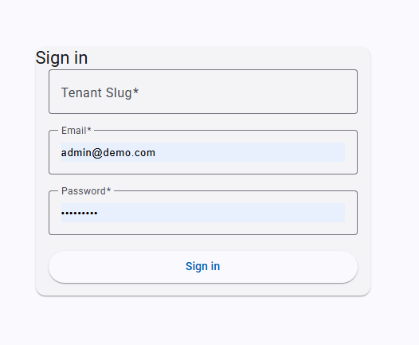
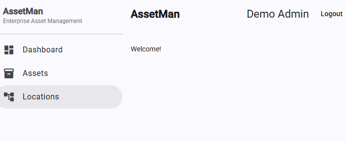
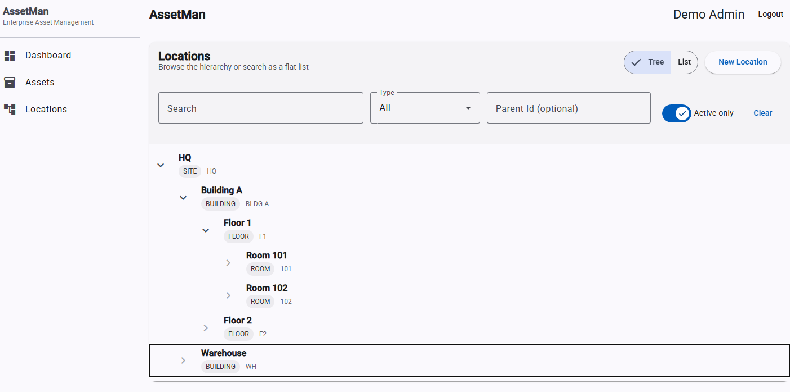

# AssetMan 🏢🔧
**Enterprise Asset Management & Maintenance Platform**


---

## Overview

**AssetMan** is an enterprise-grade, multi-tenant SaaS platform for managing **assets, properties, locations, units, and work orders** at scale.

It is designed for organizations that require:
- Strong **tenant isolation**
- Role-based access control (RBAC)
- Auditable user and asset management
- A clean path to future **multi-company per customer** expansion

The system follows a **modular monolith** architecture with clear bounded contexts and is built to evolve into a larger enterprise ecosystem.

---

## Screenshots

### Login


### Dashboard


### Assets


### Locations


---

## Core Capabilities

### Identity & Security
- Multi-tenant authentication
- JWT access + refresh tokens
- Role-based authorization (OWNER, ADMIN, MANAGER, TECHNICIAN)
- User directory with active/inactive support
- Tenant-safe request enforcement via `TenantContext`

### Asset Management
- Hierarchical locations (tree-based)
- Assets linked to properties and locations
- Extensible metadata and custom fields
- Tenant-scoped search and filtering

### Property & Unit Management
- Properties with address, codes, and status
- Units with occupancy, rent, and lifecycle status
- Safe deletion rules (conflict detection)

### Work Orders & Maintenance
- Work order lifecycle (OPEN → IN_PROGRESS → COMPLETED, etc.)
- Priority, type, scheduling, cost tracking
- Assignment and auditability
- Overdue / SLA support

---

## Architecture

### Backend
- **Kotlin + Spring Boot 3**
- Modular bounded contexts:
    - `identity`
    - `property`
    - `location`
    - `asset`
    - `workorder`
    - `common`
- JPA/Hibernate with Flyway migrations
- PostgreSQL (Testcontainers in tests)
- Transactional service layer with explicit tenant boundaries

### Frontend
- **Angular 17+ (standalone components)**
- Angular Material UI
- JWT-aware HTTP interceptors
- Role-aware routing and guards
- Vitest + Angular TestBed

---

## Multi-Tenancy Model (Current)

- **Tenant = Organization**
- All entities are explicitly scoped by `tenantId`
- Tenant context enforced at:
    - Repository queries
    - Service boundaries
    - Controller entry points
- Designed for future expansion into:
    - Customer → Company → Property → Asset hierarchy

---

## Roadmap (High-Level)

Planned future capabilities include:

- Multi-company per customer (org hierarchy)
- Company-level IT administrators
- Fine-grained permissions (RBAC → PBAC)
- Company switcher in UI
- Asset lifecycle workflows
- Preventive maintenance scheduling
- Audit logs and compliance exports
- Billing, plans, and usage tracking

(See internal roadmap documentation for phased implementation.)

---

## Local Development

### Backend
```bash
cd assetman-backend
./gradlew bootRun
```
### Frontend
```bash
cd assetman-frontend
npm install
npm run dev
```
### Testing
- Backend: JUnit 5 + Mockito + Testcontainers
- Frontend: Vitest + Angular TestBed
- Tenant isolation verified at service and repository levels
```bash
./gradlew test
```
PROPRIETARY AND CONFIDENTIAL

Copyright © 2026 Marcus L. Williams

All rights reserved.

No license, express or implied, is granted to any party to use, copy,
modify, distribute, sublicense, or create derivative works of this
software for any purpose.

Unauthorized access, use, or distribution of this software is strictly
prohibited.
